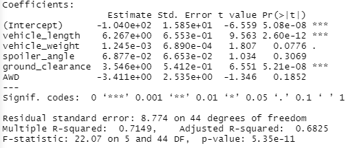
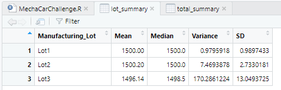
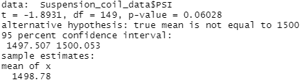
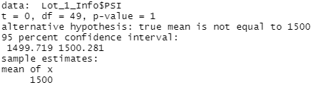
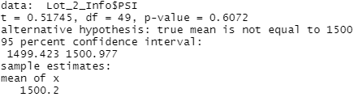
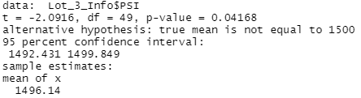

# MechaCar_statistical_Analysis

## Deliverable 1: Linear Regression to Predict MPG

Which variables/coefficients provided a non-random amount of variance to the mpg values in the dataset?

Vehicle length and ground clearance. Their p-values are less than .05 so their craiance is not random

Is the slope of the linear model considered to be zero? Why or why not?

No. If the slope was zero, there would be no correlation between the variable and MPG. with an r value of .7149 we can say there is a correlation, therefor the slope is not zero.

Does this linear model predict mpg of MechaCar prototypes effectively? Why or why not?

Although there is correlation, our r squared value is only .7149. meaning 71% of the variability of our study can be explained using this model. Further can be done to make the prediction more effective.

## Deliverable 2: Summary Statistics on Suspension Coils

The variance of the coils for all of the lots is 62.29 which is below the limit of 100psi

however when looking at individual lots we can see that lot three had a variance of 170.28 which exceeds the 100 psi limit. 

## Deliverable 3: T-Tests on Suspension Coils

### summary of t-test results for all lots and each

All lots p-value is .06028

Lot 1 p-value is 1, Lot 2 p-value is 0.6072, Lot 3 p-value is 0.04168. p-value for lot 3 is very low, below .05 and and we can rejust the null hypothesis for this lot.

## Study Design: MechaCar vs Competition

There can be many metrics that would be of interest to a consumer. Initial cost, maintenance cost, fuel economy, and horse power are some to mention.

It would be easy to compare these mestrics against the competition.

Potential null hypothesis: MechaCar has statistical difference in fuel efficiency when compared to the competition.

The data needed to run the statistical test will be miles per gallon.

